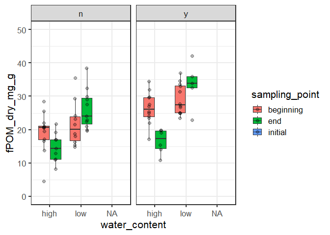

2020-11-26

  - [fPOM amount](#fpom-amount)
      - [Subsection](#subsection)
  - [Section 2](#section-2)

``` r
# Packages
library(tidyverse)
library(here)
# Parameters
  file_data <- here("data/fractions_combined.rds")

#===============================================================================

# read in data
  df <- read_rds(file_data) 
```

## fPOM amount

    ## Warning: Removed 22 rows containing non-finite values (stat_boxplot).

    ## Warning: Removed 22 rows containing missing values (geom_point).

<!-- -->

fPOM amount seems to decreas from begininng to end of incubation at high
water content but remain similar at low water content.

Fits delta13C-CO2 data

### Subsection

## Section 2
