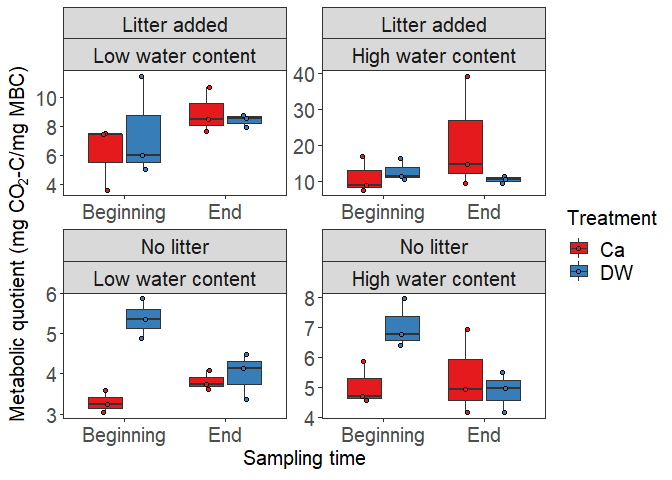

2020-12-02

  - [Section 1](#section-1)
      - [Subsection](#subsection)
  - [Section 2](#section-2)

``` r
# Libraries
library(tidyverse)
library(here)

mytheme <- theme_bw() + theme(panel.grid = element_blank()) + 
  theme(axis.text.x = element_text(size = 15)) +  
  theme(axis.text.y = element_text(size = 15)) +
  theme(axis.title.x = element_text(size = 15)) +
  theme(axis.title.y = element_text(size = 15)) +
  theme(legend.text = element_text(size = 15)) +
  theme(legend.title = element_text(size = 15)) +
  theme(strip.text.x = element_text(size = 15))

# Parameters
source(here("scripts/microbial_quotient_CUE.R"))
qco2_plot + mytheme
```

<!-- -->

``` r
#===============================================================================

# Code
```

## Section 1

### Subsection

## Section 2
